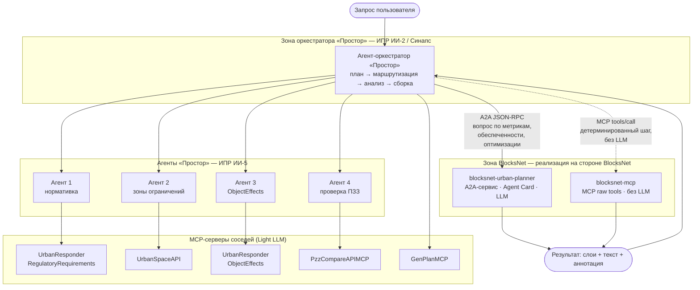
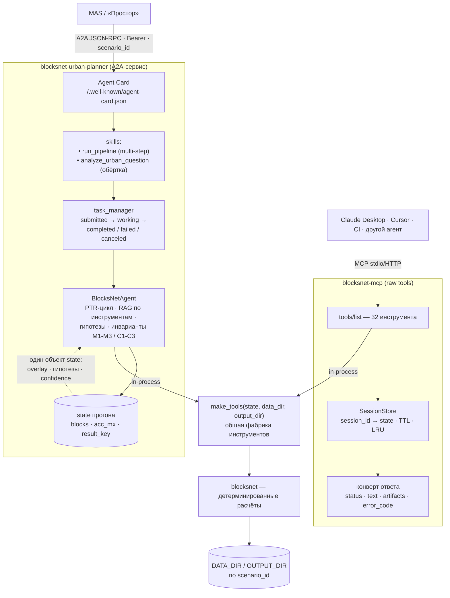
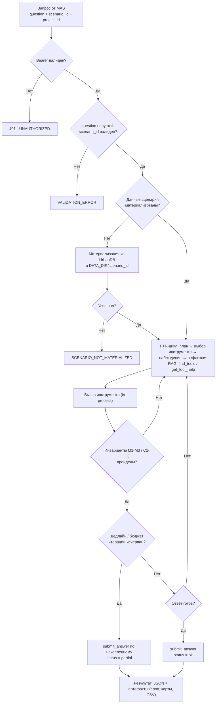
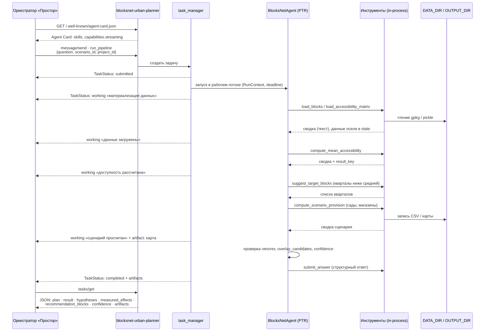
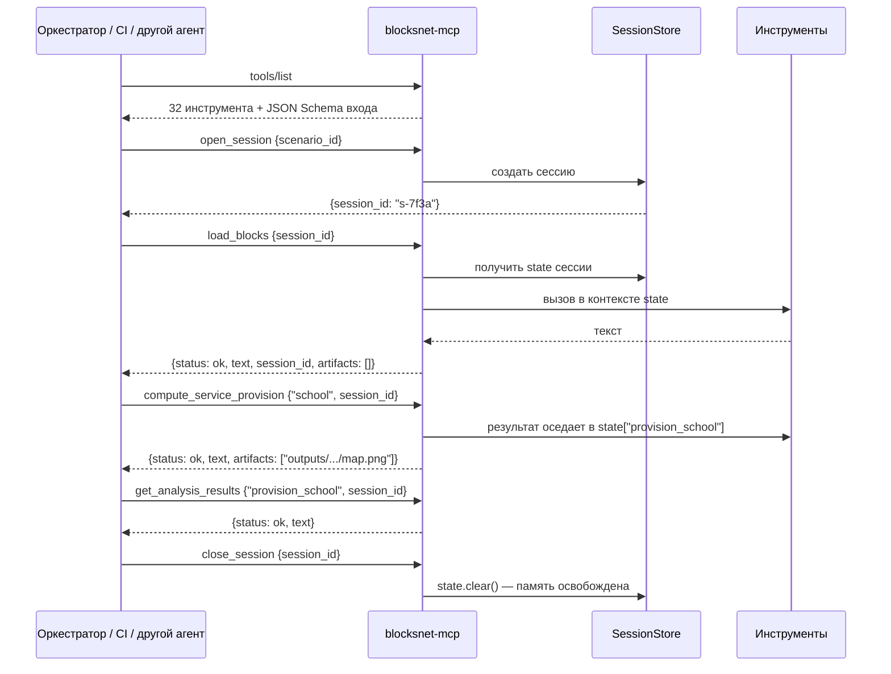

# Схема взаимодействия BlocksNet ↔ MAS (после рефакторинга)

Заменяет оранжевую зону «BlocksNet» из [MAS.drawio](MAS.drawio) (ред. 2026-06-23),
где BlocksNet был представлен оркестратором `master-urban-planner` с тремя
A2A-субагентами. Основание для пересмотра — [review.md](../decisions/review.md) R1/R2 и
решения [open_questions.md](../decisions/open_questions.md) Q4–Q7.

Формат: mermaid (исходник для воспроизведения в draw.io). Стиль зон, развилок
и блоков «Замечания/Проблемы» сохранён по образцу MAS.drawio, чтобы новая
схема встала в тот же чертёж.

---

## 1. Контекст: место BlocksNet в MAS

**Что изменилось по сравнению со старой схемой.** BlocksNet перестаёт быть
«ещё одним оркестратором с субагентами» и становится **двухвходовым узлом**:
рассуждающий вход (A2A) и детерминированный вход (MCP) — ровно та пара, которую
MAS уже умеет потреблять у соседей (`UrbanSpaceAPI`, `ObjectEffects`, `PzzCompare`).

---

## 2. Зона BlocksNet изнутри

**Ключевой инвариант схемы.** Стрелка «агент → инструменты» — **in-process**,
а не по сети. `state`, который пишут инструменты, читает постобработка агента
(`overlay_candidates`, численная верификация гипотез, `confidence_basis`,
`valid_block_ids`). Граница процесса рвёт эти связи тихо — без исключений,
с деградацией качества ответа ([review.md](../decisions/review.md) R2).

Именно поэтому три субагента старой схемы **не** становятся отдельными
сервисами — см. §3.

---

## 3. Судьба субагентов старой схемы

| Старая схема (A2A-субагент) | Новая схема | Инструменты |
|---|---|---|
| `city-blocks-aggregator` | домен инструментов «данные и структура» | `load_blocks`, `build_adjacency_graph`, `compute_density_indicators`, `compute_development_indicators`, `get_block_info` |
| `transport-analytics` | домен «доступность и связность» | `load_accessibility_matrix`, `compute_mean/median/max_accessibility`, `compute_connectivity`, `compute_land_use_accessibility`, `compute_area_accessibility` |
| `optimizer` | домен «оптимизация и сценарии» | `suggest_target_blocks`, `propose_zone_development`, `compute_scenario_provision`, `compute_service_provision`, `compute_shared_provision` |
| `master-urban-planner` | **сам A2A-сервис**: PTR-цикл вместо ручных развилок | все + `find_tools`, `get_tool_help`, `submit_answer` |

**Почему не отдельные сервисы.** Все три домена работают над одним и тем же
`state`: `blocks` (GeoDataFrame кварталов) и `acc_mx` (матрица доступности)
грузятся один раз и переиспользуются. `optimizer` читает результаты
`transport-analytics` через `state[result_key]`. Разнести их по процессам —
это либо гонять GeoDataFrame'ы по сети на каждом шаге, либо потерять связь
результатов; и то и другое хуже по всем осям, кроме организационной.

**Что при этом не теряется.** Домены остаются видимыми снаружи — через
MCP-каталог и через `find_tools`. Оркестратор «Простор» может адресовать
конкретный инструмент детерминированно, не поднимая наш LLM-цикл.

---

## 4. Маршрутизация запроса внутри BlocksNet

Старая схема хардкодила развилки («Вопрос про транспорт?» → агент 2). Новая
оставляет только те решения, которые действительно детерминированы; выбор
инструментов — за PTR-циклом.

Развилка «Есть ли исходные данные?» из старой схемы сохранена — но теперь это
не вопрос к пользователю, а материализация по `scenario_id`. Развилки «вопрос
про транспорт / оптимизацию» убраны: их роль выполняет RAG по инструментам,
поэтому добавление нового инструмента не требует правки схемы маршрутизации.

---

## 5. Сценарий A2A: эталонный запрос

Запрос из старой схемы: *«Проверь пешеходную доступность сервисов, и если в
каком-то квартале она ниже средней, предложи оптимальное количество детских
садов и магазинов для этого квартала, исходя из жилой застройки»*.

Обратите внимание: **гео-слои уходят артефактами** (пути к файлам), а не
инлайном в ответе — см. §7.

---

## 6. Сценарий MCP: детерминированный шаг без LLM

Для случаев, когда оркестратор точно знает, что нужно посчитать — не нужно
поднимать наш LLM-цикл и платить за него.

Без `session_id` инструменты работают в сессии `"default"` — однопользовательский
режим (Claude Desktop, CI) не требует изменений на стороне клиента.

---

## 7. Контракт границы

### Что BlocksNet предоставляет MAS

| Возможность | Вход | Гарантия |
|---|---|---|
| A2A skill `run_pipeline` | `question`, `scenario_id?`, `project_id?`, `max_iterations?` | task lifecycle, промежуточные статусы, артефакты |
| A2A skill `analyze_urban_question` | то же | блокирующий вызов, тот же JSON, что в контракте v1 |
| MCP `tools/list` + `tools/call` | имя инструмента, аргументы, `session_id?` | детерминированно, без LLM |
| Сессии MCP | `open/close/session_info` | изоляция состояния, TTL 1800 с, LRU 8 |

### Что BlocksNet требует от MAS

| Требование | Зачем |
|---|---|
| `Authorization: Bearer <token>` | при `AUTH_ENABLED=true` |
| `scenario_id` / `project_id` | выбор данных; без них — дефолтный `DATA_DIR` |
| Доступ к UrbanDB (`URBANDB_URL`, `URBANDB_TOKEN`) | материализация сценария |
| Терпимость к `status="partial"` | дедлайн не отменяет ответ, а усекает его |
| Один `scenario_id` на сессию MCP | смена → `SESSION_SCENARIO_MISMATCH`, нужна новая сессия |

### Коды ошибок на границе

| Код | Когда | Что делать оркестратору |
|---|---|---|
| `VALIDATION_ERROR` | пустой `question`, невалидный `scenario_id` | исправить запрос, не повторять как есть |
| `UNAUTHORIZED` (401) | нет/невалиден токен | обновить токен |
| `FORBIDDEN` (403) | нет доступа к сценарию | не повторять |
| `SCENARIO_NOT_MATERIALIZED` | UrbanDB недоступна | повторить позже |
| `LLM_NOT_CONFIGURED` | agent-tool без `CHAT_URL`/`API_KEY` | использовать A2A-вход |
| `SESSION_NOT_FOUND` | сессия истекла по TTL | `open_session` заново |
| `SESSION_SCENARIO_MISMATCH` | смена сценария в сессии | новая сессия |
| `TOOL_FAILED` | инструмент вернул текст-ошибку | читать `text`, менять аргументы |
| `TOOL_EXCEPTION` | исключение внутри инструмента | эскалация, это дефект |
| `DEADLINE_EXCEEDED` / `status=partial` | вышло время | использовать частичный результат |

---

## 8. Замечания и обязательства (в формате блоков старой схемы)

На старой схеме соседи собрали замечания вида «метод возвращает 200 000 –
1 500 000 токенов на вызов, контекст БЯМ переполняется». Фиксируем встречные
обязательства BlocksNet, чтобы не воспроизвести ту же проблему.

> **Обязательство 1 — контекст-бюджет.**
> Инструменты возвращают **текстовые сводки фиксированного размера**
> (агрегаты, топ-N, статистики), а не гео-выгрузки. Поквартальные данные и
> слои отдаются **артефактами** — путями к файлам в `OUTPUT_DIR`. Ни один
> инструмент не возвращает GeoJSON инлайном.

> **Обязательство 2 — предсказуемая стоимость.**
> У A2A-задачи есть бюджет итераций (`MAX_ITERATIONS`, по умолчанию 24) и
> дедлайн (`DEADLINE_SEC`, 480 с). По исчерпании — `status="partial"` с
> накопленным результатом, а не отказ и не бесконечный прогон.

> **Обязательство 3 — детерминированный обход LLM.**
> Любой шаг, который оркестратор умеет спланировать сам, доступен через MCP
> без нашего LLM-цикла. Это прямой ответ на «не хочу платить контекстом за
> то, что знаю точно».

> **Обязательство 4 — самоописание.**
> `tools/list` отдаёт JSON Schema входа для всех инструментов; `find_tools`
> и `get_tool_help` дают полную справку (параметры, контракт, подводные
> камни) детерминированно, без обращения к LLM. Подбор параметров с 422
> и перебором — не наш сценарий.

### Открытые вопросы к MAS

1. **Streaming или polling?** Agent Card объявляет `capabilities.streaming=true`.
   Нужен ли «Простору» поток `TaskStatusUpdateEvent` или достаточно
   `tasks/get` по завершении? От этого зависит объём шага 05.
2. **Формат артефактов.** Отдаём пути в разделяемом volume или ссылки для
   скачивания через HTTP? Первое дешевле, второе — обязательно, если сервисы
   разъедутся по разным хостам.
3. **Кто материализует сценарий** — BlocksNet сам ходит в UrbanDB или MAS
   кладёт данные в согласованный `DATA_DIR`? Влияет на шаг 06.
4. **Push notifications** — сейчас `false`. Нужны ли для длинных прогонов?
5. **Идентичность сессии.** Склеивать `session_id` MCP со `scenario_id`
   автоматически или оставить независимыми?

---

## 9. Соответствие старой схеме

| Элемент MAS.drawio (2026-06-23) | В новой схеме |
|---|---|
| «Зона деятельности агента-оркестратора BlocksNet» | сохранена как зона, внутри — два сервиса вместо четырёх агентов |
| `master-urban-planner` | `blocksnet-urban-planner` (A2A-сервис) |
| `city-blocks-aggregator` / `transport-analytics` / `optimizer` | домены инструментов, не сервисы (§3) |
| «Субагенты (реализация на стороне BloksNet)» | заменено на «MCP raw tools» — второй вход в ту же зону |
| Развилки «Вопрос про транспорт / оптимизацию?» | сняты, заменены PTR-циклом + RAG (§4) |
| Развилка «Есть ли исходные данные?» | сохранена как материализация по `scenario_id` |
| «Промежуточный результат BloksNet» | `TaskStatusUpdateEvent` + артефакты |
| «Анализ результата отработки запроса» / «План окончен?» | остаётся на стороне «Простора», не дублируется у нас |
| todowrite-таблица на 6 шагов | сохраняется как эталонный сценарий приёмки (§5) |
| Блоки «Замечания/Проблемы» | §8, встречные обязательства |

## 10. Как воспроизвести в draw.io

Зоны и цвета — по образцу MAS.drawio, чтобы схема встала в общий чертёж:

| Зона | Заливка |
|---|---|
| Зона BlocksNet | `#FFE6CC` (оранжевая, как в оригинале) |
| A2A-сервис | `#E1D5E7` (фиолетовая, как блоки агентов) |
| MCP-сервер | `#D5E8D4` (зелёная, как MCP-серверы соседей) |
| Общая фабрика инструментов | `#DAE8FC` (голубая) |
| Обязательства / замечания | `#D5E8D4` с рамкой, как блоки «Замечания/Проблемы» |

Порядок листов: §1 — контекст (вместо текущей общей страницы), §2 — врезка
по зоне BlocksNet (заменяет оранжевую зону), §5–6 — два sequence-листа,
§4 — flowchart маршрутизации.
